# Multimedia Systems & Virtual Reality

This repository contains the assignments for the Academic Courses "Multimedia Systems & Virtual Reality" taught in the Fall of 2019-2020 in Aristotle University of Thessaloniki - Electrical and Computer Engineering.

The purpose of this project is the familiarization with **Huffman Encoding** through the development an **image encoder / decoder** according to the **JPEG standard** in the **MATLAB** programming environment. The work is divided into three deliverables, which are responsible for creating an initial library of useful functions, integrating them, and constructing a series of bits through the encoded image. The quality of the coding / decoding process becomes apparent with the presentation of the reconstructed images, as well as their entropy measurements at various stages of the process.

## JPEG Library

In the first deliverable a library of functions will be created, which help in the implementation of the parts of the template. Each function is accompanied by its inversion which reconstructs the input of the first and will be part of the decoder. The general procedure to be followed in this section is described in detail below.
The original image is loaded in a 500x500x3 table format where 500x500 is the number of pixels and 3 are the three RGB components. Because the number of pixels must be a multiple of 8, the image is cropped to 496x496.

### convert2ycbcr

This function takes as an argument the imageRGB image in the form of uint8 numbers, as well as a subimg vector, which indicates the format of the sampling. Its output is the YCbCr image components as arrays of double numbers. The reason for this conversion from uint8 to double is for greater accuracy of the operations that will follow.
With the command: image = im2double (imageRGB) the color components from integers uint8 in the interval [0,255] are converted to double numbers in the interval [0,1]. At this point the image will be transformed by color components from RGB to YCbCr. The representation YCbCr consists of three components: the brightness Y, the chromaticity Cb which indicates the component of blue compared to green and the chromaticity Cr which indicates the component of red compared to green. The following formulas are used for the conversion:

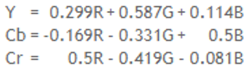

The function then takes into account its second argument, the vector subimg.

• If this is [4 4 4] then the three components are sampled with the same grid table and the function holds all the information of the color charts Cb and Cr.

• If this is [4 2 2] then every 4 samples of brightness Y correspond to 2 samples Cb and 2 samples Cr and the function holds half the information of the color charts Cb and Cr.

• If this is [4 2 0] then for every 4 samples of brightness Y correspond 1 sample Cb and 1 sample Cr and the function holds one quarter of the information of the color charts Cb and Cr.

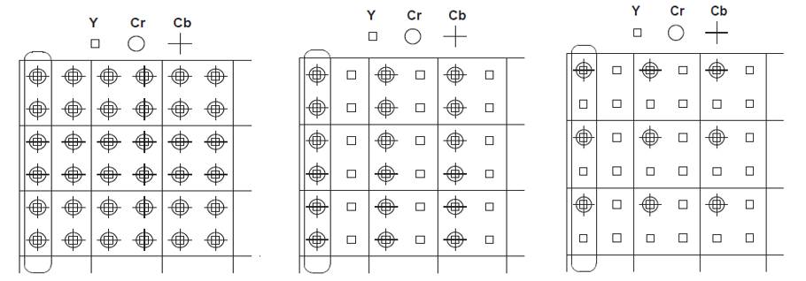

With the transform applied the three components returned by the function, namely imageY, imageCb, imageCr are in the intervals [0,1], [-0.5,0.5] and [-0.5,0.5] respectively. So in order to reduce them to the interval [0,255] we have to multiply them by 255, while to the color components we have to add the value 128.

### convert2rgb

This function takes as its argument the three components of the YCbCr image in the form of double arrays (imageY, imageCb, imageCr), as well as a subimg vector, which indicates the format of the sampling. Its output is the image in RGB components.
Initially the function manages the sampling and reverses it by applying sampling based on the values of the nearest neighbors. So in case the sampling is [4 4 4] then the tables remain as they are. However, if we have sampling [4 2 2] or [4 2 0] then the color components are interpolated by columns ([4 2 2]) or by columns and then by rows ([4 2 0]) intermediate columns and rows, which are the same as their predecessor.
Then the reverse transformation is applied to return to RGB:

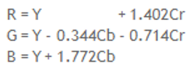

Because the components are normalized to [0,1] they multiply by 255 and convert to uint8. Finally the three tables are combined into a three-dimensional table and returned as the reconstructed image.

### blockDCT

This function takes as an argument, a block (8x8 pixels) of the image in YCbCr components and converts it based on Discrete Coefficient Transformation (DCT). Its output is the transformed block (8x8 pixels).
DCT is a method that helps to break a block of an image into pieces (spectral bands) of different importance. It essentially transforms the signal into frequency field. Thus each block (8x8) will have an element as a DC term (top left) while the rest will symbolize terms of different frequencies (AC terms).
The dat2 function of MATLAB will be used to implement the function.

### iBlockDCT

This function takes as an argument a DCT block transform (8x8 pixels) and measures it based on the Inverse Discrete Coefficient Transformation (iDCT). Its output is the block (8x8 pixels) of the image corresponding to the original YCbCr components.
The idat2 function of MATLAB will be used to implement the function.

### quantizeJPEG

This function takes as arguments: a DCT block transform (8x8 pixels), a qTable quantization table, and a qScale quantization scale. Based on the last two arguments, it quantizes the block at specific levels. Its output is the quantized block (8x8 pixels) that has undergone a DCT transformation.
The quantization process consists of dividing each element of the block by the corresponding element of qTable multiplied by qScale and then rounding the result using the fix function. This function rounds a real number to the immediately smallest integer. Thus, based on the qScale values, the block elements are quantized at specific levels.

### dequantizeJPEG

This function takes as arguments: the quantized block (8x8 pixels) that has undergone a DCT transformation, a qTable quantization table, and a qScale quantization scale. Based on the last two arguments, the block is dequantized. Its output is a dequantized block, which indicates the reconstructed transformed DCT block (8x8 pixels).
The dequantization process consists of multiplying each element of the block by the corresponding element of qTable multiplied by qScale. Thus, based on the qScale values, the block elements are dequantized.

### runLength

This function takes as arguments: the quantized block (8x8 pixels) that has undergone a DCT transformation and a DCpred predictor. Its output is a table containing path symbols in pairs of the form (precedingZeros, quantSymbols) runSymbols. This table has dimensions R x 2, where R are the path lengths found in the block.
Initially this function scans the block in a zig-zag manner. This process in code is accomplished through nested control structures (if ... else.). First we initialize a 64-position Zig-Zag vector with zeros. Our goal is to complete this vector with block elements which will be taken following the following path.
To begin, the block element (1,1) is placed in the first position of the vector. Then the i and j pointers (the position of the element in the block) of the element that has just been placed in the Zig-Zag vector are added.

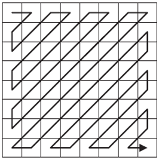

• If the sum is an even number and we are not in the first row or the last column, then the general case is to move up-right (i = i - 1 and j = j + 1), to find the next element of the block to be added to the vector.

• If the sum is an even number and we are in the first line then we move to the right (j = j + 1).

• If the sum is an even number and we are in the last column then we move down (i = i + 1).

• If the sum is an odd number and we are not in the first column or the last row, then the general case is to move down-left (i = i + 1 and j = j - 1), to find the next element of the block to be added to the vector.

• If the sum is an odd number and we are in the first column then we move down (i = i + 1) since we are not at the corner point (8.1).
If we are at this point, then we move to the right (j = j + 1).

• If the sum is an odd number and we are on the last line then we move to the right (j = j + 1).

The next step is to convert the zigzag vector into the form runSymbols (R x 2) that was previously presented. In the first row of this table are placed the elements 0 and the difference of the DCpred argument from the first element of the zigzag vector. The maximum absolute value of this element is set as 2047, for a reason that will be seen later. Then the zigzag vector runs in ascending order and in case a zero is found the number of consecutive zeros between two non-zero elements is calculated with a counter. When a non-zero element is found, it is placed in the second column of the next row of the runSymbols table, while in the first column is placed the counter, ie the number of consecutive zeros. It becomes obvious that if two elements of the vector are not separated by zeros then in the first column of the row we will have the number 0. In case the counter exceeds the value 15, then in the next line of the table the pair  [15 0] is added. The reason for this is that the first column of the rows in that table will then be encoded with a maximum of 4 bits. In the case of AC terms, The maximum absolute value of this element is set as 2047. 

Then, the last column of runSymbos which has a non-zero 2nd element is found. The lines that follow it (if any) are deleted. At the end of the table is added the line [0 0] which symbolizes its end.

### irunLength

This function takes as arguments: the runSymbols table containing the path symbols in the form pairs (precedingZeros, quantSymbols) and a DCpred predictor. Its output is an 8x8 block, which represents the reconstructed quantized block (8x8 pixels) that has undergone a DCT transformation.
This function follows the reverse procedure from runLength. So in the first step a zigzag vector is created from the runSymbols table. This is initialized with 64 positions and in its first position is placed the DC term of runSymbols (i.e. item (1,2)) added with the DCpred predictor. For the next elements of runSymbols we take into account the number of zeros (first column) and place corresponding zeros in the vector. After any zeros we place the element of the second column of the corresponding row of runSymbols.
The next step is to use the zigzag vector to create the qBlock. The exact same procedure as the previous function is used to scan the qBlock and update its appropriate component with the next zigzag vector element.

### huffEnc

This function takes as an argument the runSymbols table that contains the path symbols in bits of the form (precedingZeros, quantSymbols) of a qBlock. Its output is a series of bits (0 or 1) of huffStream representing this table in binary format with Huffman coding.
Before referring to the way in which the function converts the table into binary information, it is advisable to refer to the coding tables that will be used.
Regarding the DC term for the coded luminosities Y, ie the 2nd element of the 1st line of runSymbols, depending on its size we can distinguish the following categories, which appear in table F.1 of the standard. Each category is coded with a certain code word, as shown in Table K.3 of the template. To create the binary row of an element of the table, this code word is joined to the number encoded in binary form to its right. It should be noted that the category determines the number of bits that will make up the binary number following the code word. This way every binary number starts with 1.

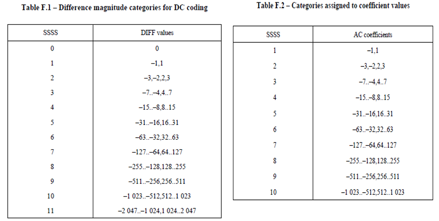

Regarding the AC terms for the coded luminosities Y, ie the 2nd element of the lines following the 1st of runSymbols, depending on its size we can distinguish the following categories, which appear in table F.2 of the standard. It should be noted that the category determines the number of bits that will make up the binary number following the code word. Depending on this number of bits that follow, but also on the number of zeros as shown in the 1st element of each line, a code word is selected from table K.5. This table has the number of zeros as rows and the number of bits needed to encode the runSymbols element as columns.
For the chromaticities Cb and Cr the procedure is analogous, with the difference that we use table K.4 instead of K.3 for the DC term and table K.6 instead of K.5 for the AC terms.
It is observed that the elements [0 0] (EOB) and [15 0] (ZRL) are coded with specific code words, which differ in brightness and color.
At this point the function of the function will be described. The appropriate DC and AC matrices are loaded first, as well as the appropriate EOB and ZRL codewords as global variables, which change externally whether it is brightness or chromaticity.
For the DC term it is checked to which category in table F.1 the width of the difference of the DC term from the prediction belongs and the appropriate code word is obtained. The measure of the number is converted to binary. If this is negative then the binary number is inverted in all its bits (and so starts from 0). If the number is not zero the code word and the binary number are combined. If the number is zero then only the codeword is added.
Regarding the other AC terms the procedure is similar but now the two-dimensional AC matrix is checked. The limit conditions for the line of runSymbols to be [0 0] or [15 0] are checked, at which point the EOB or ZLR is added to the huffStream. Similarly, it is checked to which category in table F.2 the width of the AC term belongs and the appropriate code word is obtained, ie the element of the AC table located on the line equal to the zeros plus 1 (because for any zero we start from the first line ) and in the column equal to the number of bits needed to represent the number in binary format. The number is taken and checked if it is negative so it is inverted. Then the code word and the binary number are combined. Finally it is added to the right of the existing huffStream with the horzcat function.

### huffDec

This function takes a series of bits (0 or 1) huffStream as an argument. Its output is the runSymbols table that contains the path symbols in the form (precedingZeros, quantSymbols) of a qBlock, which is reconstructed from the string by Huffman decoding.
The appropriate DC and AC matrices are loaded first, as well as the appropriate EOB and ZRL codewords as global variables, which change externally whether it is brightness or chromaticity.
For the DC term the sequence 0 or 1 consisting of the first element of the huffStream is first formed and it is checked if it is the same as any of the elements of the DC array. The sequence consisting of the first two elements of the huffStream is then formed and the same check is performed. If no element is found to satisfy the equation then the sequence with the first three elements of the huffStream is formed and the same check is repeated. The process is repeated until a sequence is found that equals some element of the DC array. Then the iteration terminates (flag control variable) and the index of the DC panel element is stored. This (if 1 is subtracted) indicates the length of the number, ie how many bits from this point onwards must be read to extract the DC term. These bits are read and converted to a binary vector. If the most important bit (MSB) is 0, then it is a negative number, so it is inverted in each of its bits. Finally, the binary number is converted to a decimal one and stored in the 2nd element of the 1st line of the returned table. A special case is when the code word is ‘00’ so no binary number follows.
Regarding the other AC terms, the procedure is similar but now the two-dimensional AC matrix is checked. So for each increasingly sized candidate keyword from huffStream, all rows and all columns of the AC matrix are checked. In case a match is found, the coordinates of the coordinates are saved and a control variable is updated to end the search (flag = 1). The coordinates stored (if 1 is subtracted) indicate the number of zeros (the row) and the number of bits of the following number (the column). These bits are read and converted to a binary vector. If the most important bit (MSB) is 0, then it is a negative number, so it is inverted in each of its bits. Finally, the binary number is converted to a decimal one and stored in the 2nd element of each line of the returned table. The number of zeros is placed in the 1st element. Special cases are ZRL, where the line [15 0] is placed and EOB, which marks the end of the bitstream and the line [0 0] is placed.

## JPEG Integration

The second deliverable will integrate the functions constructed into two general encoding / decoding functions. The correct division of an image into blocks and its reconstruction from them will be demonstrated.

### JPEGencode

This function takes as arguments: the original img image, the subimg sampling table and the qScale quantization scale. Its output is N + 1 cells containing JPEGenc structs, where N is the number of total blocks into which the image components are divided.

The first element of the cell is a struct, which contains the appropriate arrays:

• qTableL: the quantization table for brightness (multiplied by qScale).
• qTableC: the quantization table for chromaticities (multiplied by qScale).
• DCL: cell with the elements used to encode the DC coefficients for brightness block.
• DCC: cell with the elements used to encode the DC factors for block chromaticity
• ACL: cell with the elements used to encode the AC coefficients for brightness block.
• ACC: cell with the elements used to encode AC factors for block chromaticity

The remaining cells will be structs with the fields:

• blkType: the type of block ("Y", "Cb", "Cr").
• indHor: the pointer that shows the horizontal position of the block.
• indVer: the pointer that shows the vertical position of the block.
• huffStream: the block encoded as a sequence of bits.

The procedure for this function is summarized in the following steps.

Initially the convert2ycbcr function is called with argument the original RGB image and the sampling table and the YCbCr coordinates are returned which are scaled accordingly. Then separately for brightness and dimensionality, through a double iteration structure, the respective block (8x8 pixels) is extracted from the tables per column and given as an argument to blockDCT. The result is placed in the corresponding 8x8 square of a new table, separately for brightness and color. The next step is to extract the same size blocks from the new arrays with the same iterative procedure and place them as an argument in the quantizeJPEG function. Attention must be paid to the different quantization table for brightness and color. The new arrays created from this step are re-engaged in a dual iterative structure, which takes up an 8x8 square each time. This is given as an argument to runLength along with the DCpred prediction, which is initially zero and then is the DC term of the previous block. RunSymbols arrays are grouped into cell structures (due to different sizes) separated for brightness and color. Finally the runSybmols cells are run and each element is given as an argument to huffEnc. The AC and DC coding tables, as well as the EOB and ZRL, change externally as global variables before calling the function for brightness and color. HuffStream arrays are grouped in cell structures similar to runSymbols. The final step is to scan these structures and store their contents in the huffStream element of the struct of each cell (1 cell for each stream). The remaining elements of the struct are completed accordingly. Attention must be paid to indHor and indVer. For the first one, the index must be divided by the number of blocks horizontally for each table (it differs depending on the sampling) and the result must be rounded. For the second the remainder of the integer division of the pointer with the number of horizontal blocks must be found.

### JPEGdecode

This function take the cells from JPEGenc structs as arguments. Its output is the reconstructed imgRec image in the RGB field.

Initially it extracts the necessary tables from the first cell. The qTableL and qTableC arrays were multiplied by qScale because this function does not know it. Depending on the number of JPEGenc cells, the function predicts sampling.
Then we scan JPEGenc. For each element we export the blkType type, indHor, indVer and huffStream. Here, too, attention must be paid to the different quantization table for brightness and color. Depending on this formula we set the Huffman arrays for brightness and color and the EOB and ZRL elements and call the huffDec function with the huffStream argument we exported and get a runSymbols array.
The next step is to create the quantum factor tables. For this reason we call the irunLength function with arguments the runSymbols we calculated and a DCpred argument that is initially set to 0, while in each subsequent iteration it takes the value of the DC term of the previous block. If we subtract the unit from the pointers, multiply by 8 and add the unit we can find the position of the block in the table of quantized coefficients (ie {(indHor-1) * 8 + 1} and {(indVer-1) * 8 + 1}) and so we can repetitively construct the tables.
The new arrays created from this step are involved in a double iterative structure, which occupies an 8x8 square at a time. This is given as an argument to dequantizeJPEG, which returns a block that is placed in the appropriate position of a new table separately for each component. The same process is repeated, when the blocks are passed as an argument to iBlockDCT and new arrays are created from the blocks it returns. These tables will be given as an argument to convert2rgb along with the sampling table. Previously, however, they would have been transformed so that the brightness is in the interval [0 1] and the chromaticities are in [-0.5 0.5].

## demo 1

This is a script, which demonstrates the correct use of the convert2ycbcr, blockDCT, quantizeJPEG functions and their inverse in order to take reconstructed images and compare their quality. Initially Figure 1 is sampled with 4: 2: 2, while Figure 2 with 4: 4: 4. In addition, the same quantization tables are applied to the images but different qScale values, namely 0.6 for the first and 5 for the second. The procedure is the same as described in the JPEGencode function. The results of the reconstruction are shown below:

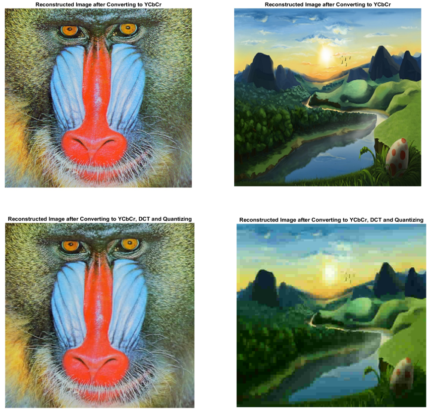

## Results

This section will present the results of the application in the images of the JPEGencode and JPEGdecode functions for different parameter values, namely qScale. Specifically, the results for values {0.1, 0.3, 0.6, 1, 2, 5, 10} will be shown. For this purpose a script testJPEG has been written which repeatedly calls the functions for these values and records the results of the reconstruction process. Initially loads Huffman quantization boards and coding boards. Then it loads the original image and reconstructs it by successively calling the two general functions. The reconstructed image is displayed on the screen, and finally its Mean-Squared Error is measured in relation to the original and the bit size of the encoded image returned by JPEGencode. The input of the function changes **manually** from the first image and 4: 2: 2 sampling to the second and 4: 4: 4.

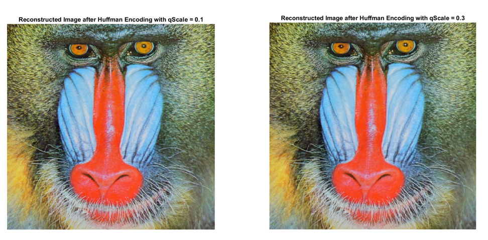

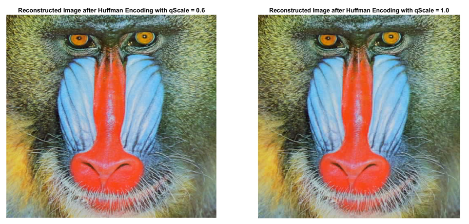

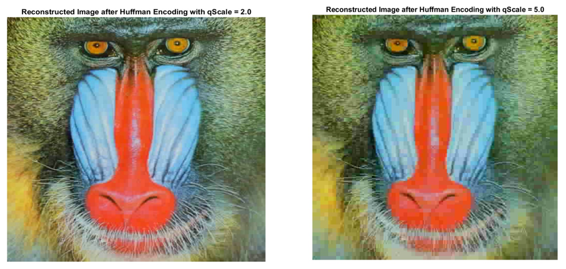

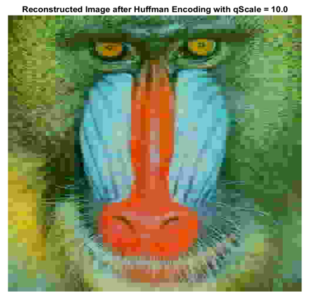

Obviously the higher the qScale the worse the build quality. This makes sense as in quantization qScale is at the denominator and therefore if it is large enough values are quantized to level 0 and so cannot be recalculated. From the diagrams we see that qScale is proportional to MSE and inversely proportional to the number of bits of the encoded image.

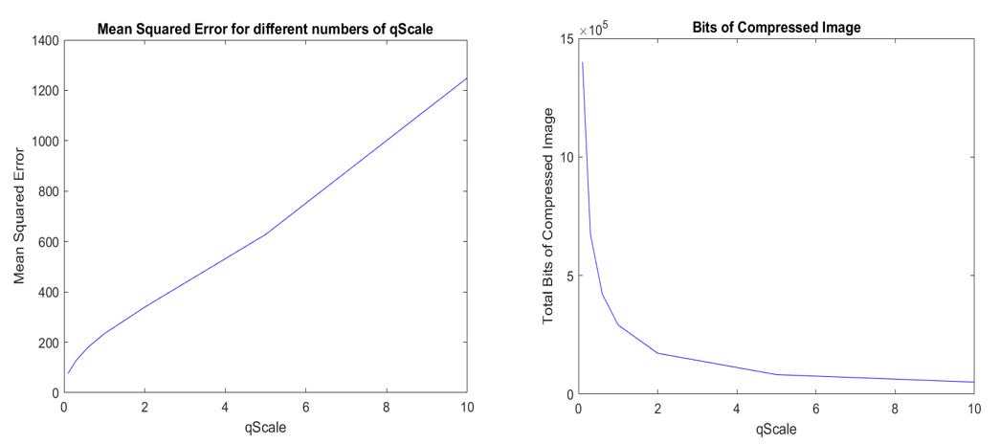

The results for the second image are following:

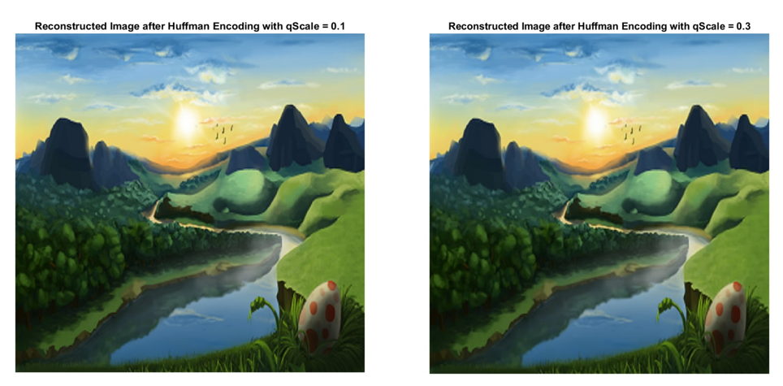

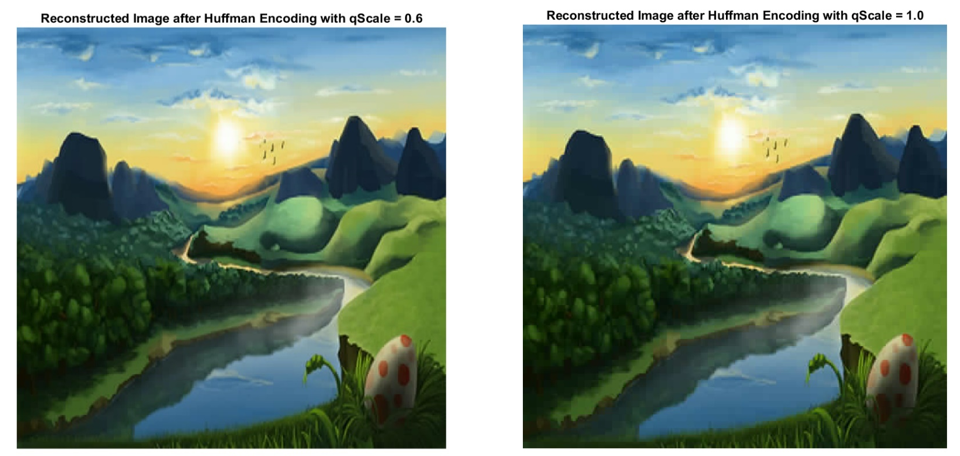

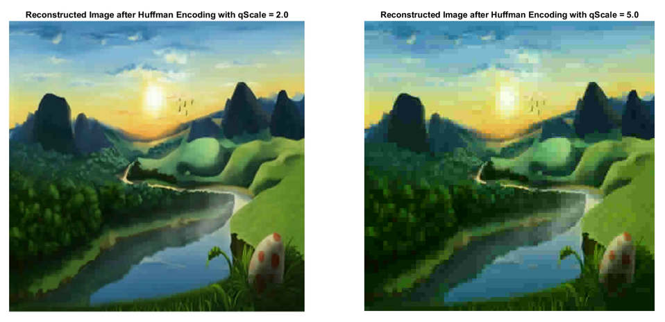

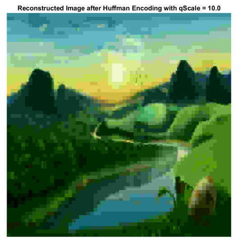

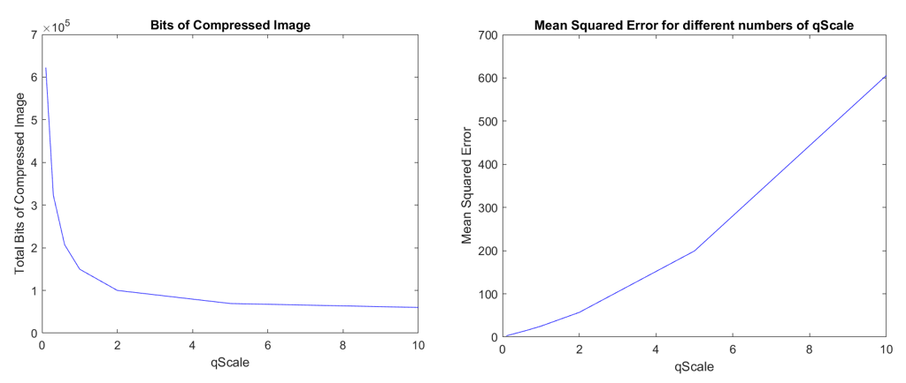

## demo 2

In this process the entropy of the initial image of the quantized arrays with the DCT coefficients and of the runSymbols arrays with the path lengths is calculated. For the last two cases, the average of the entropies of all arrays for each component is taken. To calculate entropy is used the entropy function.

| **Entropy Table** | **Initial Image** | **Quantized DCT Coeff.** | Average Entropy of run Lengths |
| :---------------: | :---------------: | :----------------------: | :----------------------------: |
|    **Image 1**    |     **7.753**     |        **0.318**         |           **0.814**            |
|    **Image 2**    |     **7.777**     |        **0.124**         |           **0.172**            |

